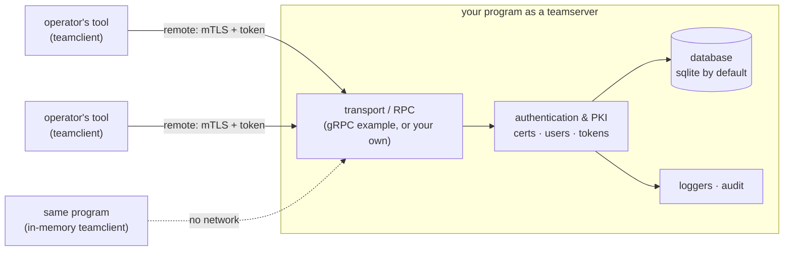

<div align="center">
  <br> <h1> Team </h1>

  <p>  Transform any Go program into a client of itself, remotely or locally.  </p>
  <p>  Use and manage teamservers and clients with code, with their CLI, or both.  </p>
</div>


<!-- Badges -->
<!-- Assuming the majority of them being written in Go, most of the badges below -->
<!-- Replace the repo name: :%s/reeflective\/template/reeflective\/repo/g -->

<p align="center">
  <a href="https://github.com/reeflective/team/actions/workflows/go.yml">
    
  </a>

  <a href="https://github.com/reeflective/team">
    
  </a>

  <a href="https://pkg.go.dev/github.com/reeflective/team">
    
  </a>

  <a href="https://goreportcard.com/report/github.com/reeflective/team">
    
  </a>

  <a href="https://codecov.io/gh/reeflective/team">
    
  </a>

  <a href="https://opensource.org/licenses/BSD-3-Clause">
    
  </a>
</p>


-----
## Overview

You wrote a Go tool. Now your team wants to use *one shared instance* of it — together, securely,
each from their own machine. Suddenly you need user authentication, TLS certificates, a database,
one or more network listeners, a way to hand out and import connection configurations, and a CLI to
manage all of it. None of that is your tool's actual job.

`reeflective/team` is that infrastructure, done for you. It turns any Go program into a
**teamserver** (serving its functionality to a team) and a **teamclient** (consuming it) — whether
both run in the *same process*, or the client connects to a *remote* instance over the network. You
keep writing your tool; the library handles collaboration, identity, transport and configuration.

A few programs that fit the model:

- A **C2 framework** whose operators all drive one shared server (this library was extracted from one).
- A **password cracker** whose lightweight clients offload jobs to a GPU/compute host.
- Any tool that should sometimes be *just a local command* and sometimes *a server for the team* —
  same binary, same code, decided at runtime.

Two things stay true throughout: a program is a client of its peers as much as a server to them, and
**humans use software, not the inverse** — so the library serves both the developers embedding it and
the users operating it, each through an interface fit for them.


-----
## Architecture



The core (`client` and `server` packages) owns users, certificates, the database and logging. It
does **not** own the transport: you plug a transport/RPC backend into the server (a `Handler`) and a
matching dialer into the client (a `Dialer`). A ready-made gRPC backend lives in `example/`. The same
teamclient code talks to an in-process server or a remote one — the call site doesn't change.


-----
## Quickstart (Developers)

Embedding a teamclient or teamserver should fit in a handful of function calls.

**The teamserver is a *component* of your application, not the application itself.** A program built
only around `server.New` — with no logic of its own — is a valid teamserver, but it just manages
users, listeners and configs: it does nothing your tool actually does, and is useless on its own.
That standalone shape is handy for demos, tests, or a dedicated admin binary, but in a real tool you
don't make it your `main`. Instead you **graft the generated command tree onto your application's own
root command**, where it becomes a `teamserver` subcommand alongside everything else your program
does — which is exactly why users type `cracker teamserver daemon`, not `teamserver daemon`.

`commands.Generate` returns a plain `*cobra.Command`, so embedding is one `AddCommand`:

```go
// Your application already has a root command and its own subcommands.
rootCmd := newAppRootCommand() // "cracker", with its own logic

// Build the teamserver core (no transport backend needed for a purely
// in-memory server; add one — see below — to serve remote clients).
teamserver, err := server.New("cracker")

// Generate the teamserver command tree and graft it under your root.
// It nests the client-only commands under a "client" subcommand too.
teamCmds := commands.Generate(teamserver, teamserver.Self())
rootCmd.AddCommand(teamCmds) // now: `cracker teamserver ...`

rootCmd.Execute()
```

If you *do* want a dedicated, teamserver-only binary (the demo/admin shape above), just run the
generated tree directly as your root — this is what the standalone `teamserver` binary in the CLI
section is:

```go
teamserver, err := server.New("teamserver")
serverCmds := commands.Generate(teamserver, teamserver.Self())
serverCmds.Execute() // the whole binary IS the teamserver
```

Either way, serving remote clients means giving the server a transport backend. The same as above,
over the gRPC example backend:

```go
// The example directory ships a ready-made gRPC listener backend.
gTeamserver := grpc.NewListener()

// Create the teamserver and register the gRPC backend with it:
// any gRPC teamclient will now be able to connect to it.
teamserver, err := server.New("teamserver", server.WithHandler(gTeamserver))

// The server can also serve itself in-memory. Give it the matching
// client-side gRPC backend so its own teamclient can dial it.
gTeamclient := grpc.NewClientFrom(gTeamserver)
teamclient := teamserver.Self(client.WithDialer(gTeamclient))

// Generate and run the command tree.
serverCmds := commands.Generate(teamserver, teamclient)
serverCmds.Execute()
```

See the [`example/`](https://github.com/reeflective/team/tree/main/example) directory for complete
client and server entrypoints.


-----
## What you get

- **Works out of the box** — a pure-Go sqlite database, file + stdout logging, and a full mTLS PKI
  are all configured for you. A usable teamserver is the two calls above.
- **Local and remote, same code** — run the client in-process (no network) or against a remote
  teamserver; the calling code is identical. Actual network location is irrelevant to the model.
- **Secure by default** — mutual-TLS transport, certificate-based user authentication and per-user
  tokens, in a zero-trust posture between clients and servers. The teamserver's job is to prove
  *who* is calling; authorization stays with your application.
- **Batteries, but swappable** — replace the transport/RPC layer, the database, the loggers or the
  filesystem backend when you outgrow the defaults, without giving up the rest.
- **Two audiences, two interfaces** — a small Go API for developers, and an embeddable
  `teamserver`/`teamclient` CLI tree (with shell completion) for users.
- **Transport-agnostic** — ships a gRPC example backend, but forces no transport on you, and needs
  none at all for in-memory use.
- **Automation-friendly** — non-blocking API, `systemd` unit generation, persistent listeners, and
  importable client configuration files for painless deployment.


-----
## Components & Terms

The library is two Go packages (`client` and `server`) for programs that need to act as:

- A **teamclient** — a program (or one of its components) that relies on a peer to serve some
  functionality shared across a team. That can be as simple as posting a message to the team, or as
  involved as shipping data to a remote compiler backend to build.
- A **teamserver** — the server-side counterpart. It can do anything, from merely notifying the team
  of client connections all the way to running heavy, resource-hungry tasks that only belong on a
  server host.

Vocabulary used throughout the code and docs:

- **teamclient** — the client-side toolset provided by the library (`team/client.Client`), or the
  software embedding it.
- **teamserver** — the server-side toolset (`team/server.Server`), or the software embedding it.
- **team tool(s)** — any program using either or both of the components.


-----
## CLI (Users)

Users drive their team tools through an embeddable command tree. The examples below assume a binary
named `teamserver` whose only purpose is to *be* a teamserver (no application logic of its own, so
useless on its own). In a real tool `cracker`, these become `cracker teamserver daemon`,
`cracker teamserver client users`, and so on.

<details>
<summary><b>Server and client command trees</b></summary>

```
$ teamserver
Manage the application server-side teamserver and users

Usage:
  teamserver [command]

teamserver control
  client      Client-only teamserver commands (import configs, show users, etc)
  close       Close a listener and remove it from persistent ones if it's one
  daemon      Start the teamserver in daemon mode (blocking)
  listen      Start a teamserver listener (non-blocking)
  status      Show the status of the teamserver (listeners, configurations, health...)
  systemd     Print a systemd unit file for the application teamserver, with options

user management
  delete      Remove a user from the teamserver, and revoke all its current tokens
  export      Export a Certificate Authority file containing the teamserver users
  import      Import a certificate Authority file containing teamserver users
  user        Create a user for this teamserver and generate its client configuration file
```

A program may ship a client-only counterpart, `teamclient`, with no server code and a smaller set:

```
$ teamclient
Client-only teamserver commands (import configs, show users, etc)

Usage:
  teamclient [command]

Available Commands:
  import      Import a teamserver client configuration file for teamserver
  users       Display a table of teamserver users and their status
  version     Print teamserver client version
```
</details>

Typical **teamserver** workflow (often run by a team admin):

```bash
# 1 - Generate a user for a local teamserver, and import users from a file.
teamserver user --name Michael --host localhost
teamserver import ~/.other_app/teamserver/certs/other_app_user-ca-cert.teamserver.pem

# 2 - Start some listeners, then start the daemon (blocking).
# The first call uses the application-defined default port; --persistent makes
# the listeners come back automatically when the server runs in daemon mode.
teamserver listen --host localhost --persistent
teamserver listen --host 172.10.0.10 --port 32333 --persistent
teamserver status                                                   # Saved listeners, loggers, databases, etc.
teamserver daemon --host localhost --port 31337                     # Blocking: serves persistent listeners + one at localhost:31337

# 3 - Export and enable a systemd service for the teamserver.
teamserver systemd                                                  # Default host, port and listener stack.
teamserver systemd --host localhost --binpath /path/to/teamserver   # Specify the binary path.
teamserver systemd --user --save ~/teamserver.service               # Write to a file instead of stdout.

# 4 - Import the admin's own "remote" config from (1), and use it.
teamserver client import ~/Michael_localhost.teamclient.cfg
teamserver client version                                          # Client and server version info.
teamserver client users                                            # All registered users and their status.

# 5 - Quality of life.
teamserver _carapace <shell>                                       # Source the shell completion engine.
```

Typical **teamclient** workflow (available to every user's tool in the team):

```bash
# Import a remote teamserver configuration handed out by an administrator.
teamclient import ~/Michael_localhost.teamclient.cfg

# Query the server.
teamclient users
teamclient version
```


-----
## Customization & backends

Developers get a slightly larger surface than the CLI exposes, and can replace parts or all of the
default backends while keeping the rest:

- **Transport / RPC** — implement the server `Handler` (init/listen) and client `Dialer`
  (init/dial/close) interfaces to bring your own transport. The gRPC backend in
  `example/transports/` is one such implementation, not a hard dependency. In-memory servers need no
  transport at all.
- **Database** — the default is a file-based, pure-Go sqlite DB, and can be configured to run in
  memory (`server.WithInMemory()`); swap it via the database option.
- **Loggers** — pass your own logger; otherwise the cores log to stdout (≥ warning) and to default
  files (≥ info). Provide a custom logger and the cores stop writing to stdout and their own files.
- **Filesystem** — the app directory, certs and config locations are configurable.

A useful rule of thumb: a tool's developers can usually anticipate ~70% of the valid ways their tool
will be operated, and should program their teamclients for those; the remaining ~30% is left to users
through the CLI (notably the *selection strategy* — how a teamclient picks the teamserver it connects
to).


-----
## Behavioral notes

- All errors returned by the API are logged before being returned (per the configured log behavior).
- Filesystem interactions are deferred until they actually need to happen.
- Critical errors are returned rather than `log.Fatal`/`panic` — except the certificate
  infrastructure, which must succeed for security reasons.
- Except `server.ServeDaemon` (behind `teamserver daemon`), all API functions and interface methods
  are non-blocking; the code documentation flags this where relevant.
- The loggers handed out by the cores are never nil.


-----
## Documentation

- Go API reference: [pkg.go.dev/github.com/reeflective/team](https://pkg.go.dev/github.com/reeflective/team).
- Client and server packages: see the
  [directories section](https://pkg.go.dev/github.com/reeflective/team#section-directories) of the Go docs.
- The `example/` subdirectories are documented and are the best introduction to using the library.


-----
## Comparison with the Hashicorp Go plugin system

The [Hashicorp plugin system](https://github.com/hashicorp/go-plugin) solves a nearby but different
problem — emulating dynamic code loading in a compiled language over a gRPC backend. The key
differences:

- **In-memory *and* remote.** Hashicorp plugins are always a separate binary (executed out of
  process even when they look in-memory). `team` clients and servers are meant to run both in memory
  and remotely (here "remote" means a distinct process; network location is irrelevant).
- **Not about dynamic code execution.** `team`'s goal isn't to emulate plugins; it's to let a
  program that *should* be a server to several clients act as one, easily and securely.
- **No forced transport.** Hashicorp mandates gRPC. `team` uses gRPC only for its example backend and
  forces no transport on you — nor requires one for in-memory use.
- **First-class users.** Both use certificate-based connections, but `team` builds in a notion of
  authenticated users, promotes Mutual TLS, and ships loggers and a database for working data.


-----
## Background

The project was extracted from a security-oriented tool that used this approach to cleanly separate
client and server binaries (the former needing little of the latter's code). Its heavy CLI exposure
prompted a rethink of how "collaborative programs" could be approached from two distinct viewpoints —
the tools' developers and their users — and the reusable core was then restructured and repackaged
behind coherent API and CLI interfaces.

The client-server paradigm is ubiquitous, and so is the problem of writing software that collaborates
easily with peer programs. Doing that *well* in large and small programs alike is harder than it
sounds — especially when the software must extend humans' ability to collaborate without narrowing
the number of ways they can, for simple and complex tasks both.


-----
## Status

The CLI and API are considered mostly stable; they may grow a little but are designed to be minimal
and won't shrink. New behavior is expected to arrive through `client.Options` / `server.Options`
rather than changes to the teamclient/teamserver types.

The **Possible enhancements** below were each roughly one minor release (`0.1.0`, `0.2.0`, …) toward
`v1.0.0`, and have now all landed.

- Please open an issue or PR for any bug — it will be resolved promptly.
- Features and PRs are welcome when they're likely to help most users.

## Possible enhancements

Not a roadmap — these are changes the author would gladly review contributions or ideas for. The
library aims to stay small, with a precise role; contributions ideally strengthen the core/transport
code or widen interoperability with other Go programs.

- [x] Add support for encrypted sqlite. _(Opt-in via `server.WithDatabaseKey(key)`: the default, file-based SQLite database is then transparently encrypted at rest through the pure-Go [adiantum](https://github.com/ncruces/go-sqlite3/tree/main/vfs/adiantum) VFS — no CGO, works on the default and `wasm_sqlite` builds. The key is never persisted next to the database. Leaving it unset keeps the current plaintext behavior.)_
- [x] Finish replacing logrus with the standard-library `slog`, behind a single package shared by client and server. _(Core is now `slog`-only, behind the public `team/log` package; logrus remains only in one example transport to demonstrate a self-owned backend.)_
- [x] Add tests for the most sensitive paths (certificate management, database, etc.). _(The `log` package, version/transport flow, the certificate manager (PKI generation, storage round-trips, CA chain verification — now ~80% covered), the database DSN layer, and the teamserver user lifecycle (create/authenticate/delete revocation, mutual-TLS config) are now unit-tested.)_
